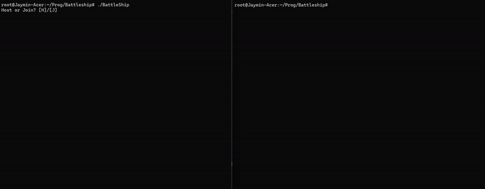
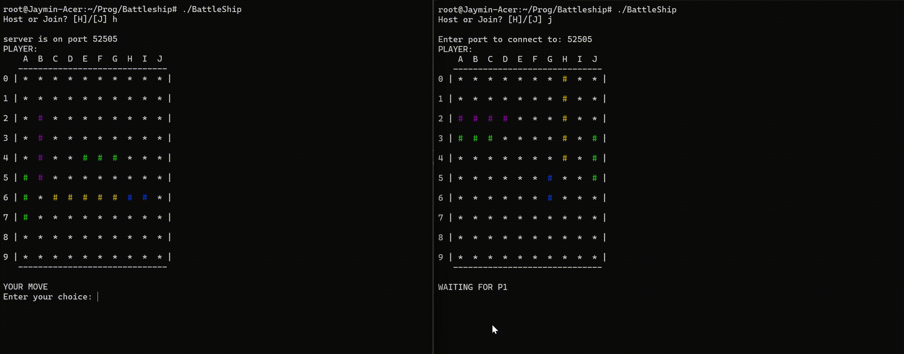

# BattleShip on CLI with multiplayer support!
### (*Runs locally*)

### Installation:
##### Run 'make' or 'make all'

### Usage:
##### Run exe and use 'h' for hosting or 'j' for joining an open port.

### How to play:
##### This program follows a strict server-client send-receive order.

